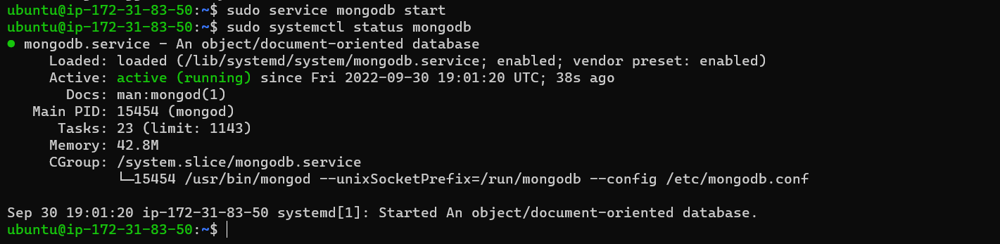
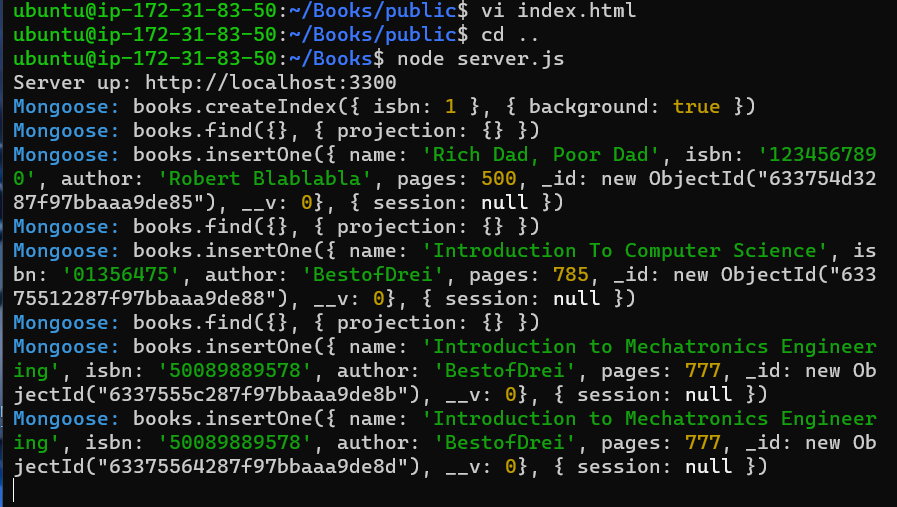
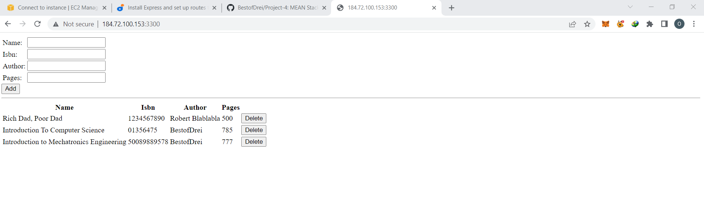

# Start

## Mean stack deployment to ubuntu in aws

`sudo apt update`

`sudo apt upgrade`

`sudo apt -y install curl dirmngr apt-transport-https lsb-release ca-certificates`

`curl -sL https://deb.nodesource.com/setup_12.x | sudo -E bash -`

`sudo apt install -y nodejs`

`sudo apt-key adv --keyserver hkp://keyserver.ubuntu.com:80 --recv 0C49F3730359A14518585931BC711F9BA15703C6`

`echo "deb [ arch=amd64 ] https://repo.mongodb.org/apt/ubuntu trusty/mongodb-org/3.4 multiverse" | sudo tee /etc/apt/sources.list.d/mongodb-org-3.4.list`

`sudo apt install -y mongodb`

`sudo service mongodb start`

`sudo systemctl status mongodb`

`sudo apt install -y npm`

`sudo npm install body-parser`

`mkdir Books && cd Books`

`npm init`

`vi server.js`

## Install express and set up routes to the server

`sudo npm install express mongoose`

`mkdir apps && cd apps`

`vi routes.js`

`mkdir models && cd models`

`vi book.js`

`cd ../..`

`mkdir public && cd public`

`vi script.js`

`vi index.html`

`cd ..`

`node server.js`

`curl -s http://localhost:3300`

Now you can access our Book Register web application from the Internet with a browser using Public IP address or Public DNS name

END